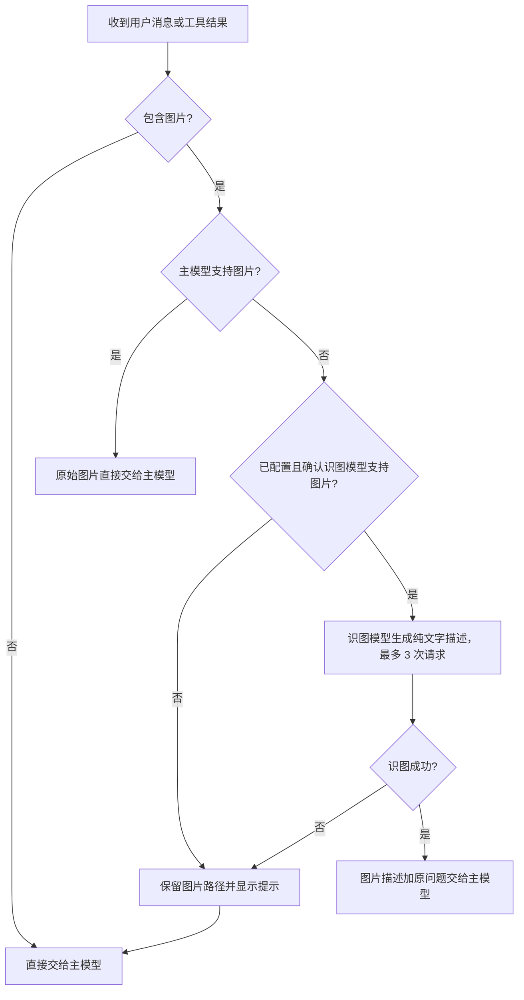

 
</p>

<h1 align="center">Reasonix Support Vision Model</h1>

<p align="center">
  基于 <a href="https://github.com/esengine/DeepSeek-Reasonix">Reasonix</a> 二次开发的社区版本<br/>
  为文本主模型补充可配置的识图模型，并把工具读取到的本地图片接入同一条视觉处理链路
</p>

<p align="center">
  <a href="https://github.com/Junjie88/Reasionix-SupportVisionModel/tree/main-v2"></a>
  <a href="./LICENSE"></a>
  <a href="https://github.com/esengine/DeepSeek-Reasonix"></a>
</p>

> [!IMPORTANT]
> 本项目不是 Reasonix 官方发行版，而是基于
> [esengine/DeepSeek-Reasonix](https://github.com/esengine/DeepSeek-Reasonix)
> 的二次开发版本。Reasonix 原项目的著作权、商标和贡献归原项目及其贡献者所有。
> 本仓库会继续保留上游 Git 历史，方便同步并合并官方更新。

## 项目定位

Reasonix 原本已经支持多模态模型直接接收用户图片。本项目在此基础上增加了一条视觉回退链路：
当当前主模型不支持图片时，可以从**已经配置的模型**中选择一个“识图模型”，先把图片转换成文字描述，再把描述和用户原问题交给主模型继续分析、写代码和调用工具。


本项目不会要求用户再配置一套独立的 Vision Provider。识图模型和主模型一样，来自现有 Provider 与模型列表。

## 主要改动

- **可配置识图模型**：桌面端设置中可以从现有模型里选择“识图模型”。
- **保留原生多模态链路**：主模型本身支持图片时，仍然直接接收原始图片，不经过识图模型转述。
- **文本主模型视觉回退**：主模型不支持图片时，由识图模型生成受边界标记保护的纯文字描述，再交给主模型。
- **工具图片识别**：模型在工作过程中通过 `read_file` 读取 PNG、JPEG、GIF、WebP 图片时，也可以进入同一条视觉链路。
- **MCP 图片结果处理**：MCP 工具返回结构化图片时，可以直接交给多模态主模型，或由识图模型转换为文字。
- **图片预处理**：统一检测格式、控制大小并缩放超大图片；发送给模型的最长边限制为 1568 像素。
- **严格重试上限**：每批图片首次请求失败后最多重试 2 次，一共最多 3 次真实识图请求，不叠加 Provider 内部重试。
- **运行状态可见**：识图开始、重试、成功、失败以及交给主模型的内容都有对应事件或调试信息。
- **失败可降级**：未选择识图模型、模型不支持图片或识图失败时，保留图片路径并让原问题继续进入主模型，不会让整个会话直接中断。

## 图片路由流程



## 当前支持范围

已经支持：

- 用户在消息中直接附加的本地图片。
- `read_file` 工具读取的 PNG、JPEG、GIF、WebP 图片。
- MCP 工具返回的结构化图片结果。
- 主模型原生多模态直传，以及文本主模型通过识图模型回退。
- 图片过大时的格式检测、大小限制和缩放处理。

暂未自动接入：

- 普通文本中的远程图片网址。
- Shell 输出中直接打印的 base64 图片内容。
- 图片生成完成后，自动再次调用识图模型做视觉验收。

这些场景可以后续继续扩展，不影响当前用户附件和本地文件图片的识别链路。

## 使用方法

### 桌面端设置

1. 在 Provider 设置中配置主模型和一个支持图片输入的模型。
2. 在模型列表中，将实际支持图片输入的模型标记为“识图模型”。
3. 在 Agent 设置中找到“识图模型”，选择刚才配置的模型。
4. 主模型支持图片时会直接读图；主模型不支持图片时会自动使用所选识图模型。

### 配置文件

也可以在 `reasonix.toml` 中设置：

```toml
[agent]
vision_model = "provider-name/vision-model-name"

[[providers]]
name = "provider-name"
# 其余地址、密钥环境变量和模型配置保持原样
models = ["text-model-name", "vision-model-name"]
vision_models = ["vision-model-name"]
```

`vision_model` 必须指向已经配置的模型。请不要把不支持图片输入的模型加入 `vision_models`。
完整字段可以参考 [reasonix.example.toml](./reasonix.example.toml)。

## 从源码构建

### 获取本项目

```sh
git clone -b main-v2 https://github.com/Junjie88/Reasionix-SupportVisionModel.git
cd Reasionix-SupportVisionModel
```

### CLI / TUI

项目使用 Go 1.25 或更高版本：

```sh
go build -o bin/reasonix ./cmd/reasonix
```

Windows 可以把输出名改为 `bin/reasonix.exe`。

### 桌面端

桌面端需要 Go、Node.js、pnpm、Wails CLI 和系统 WebView 运行环境：

```sh
go install github.com/wailsapp/wails/v2/cmd/wails@latest
cd desktop/frontend
pnpm install
cd ..
wails build
```

构建结果位于 `desktop/build/bin/`。其他平台依赖和开发方式见
[desktop/README.md](./desktop/README.md)。

## 同步 Reasonix 上游更新

本项目建议使用下面的远程结构：

```text
origin    https://github.com/Junjie88/Reasionix-SupportVisionModel.git
upstream  https://github.com/esengine/DeepSeek-Reasonix.git
```

首次克隆后添加上游：

```sh
git remote add upstream https://github.com/esengine/DeepSeek-Reasonix.git
```

后续同步官方 `main-v2`：

```sh
git fetch upstream
git switch main-v2
git merge upstream/main-v2
git push origin main-v2
```

合并前建议先运行相关 Go 测试和桌面前端生产构建。

## 隐私说明

图片会根据路由结果发送给主模型或你配置的识图模型 Provider。请在上传包含个人信息、内部文档、密钥、付款信息或其他敏感内容的图片前，确认对应服务的隐私政策和数据处理规则。

## 与上游项目的关系

- 上游项目：[esengine/DeepSeek-Reasonix](https://github.com/esengine/DeepSeek-Reasonix)
- 本项目仓库：[Junjie88/Reasionix-SupportVisionModel](https://github.com/Junjie88/Reasionix-SupportVisionModel)
- 当前开发分支：`main-v2`
- 许可证：[MIT License](./LICENSE)

感谢 Reasonix 原项目维护者和所有贡献者。本项目保留上游提交历史，并在其基础上维护视觉模型路由相关改动，会尽量跟进Reasonix的更新。


---

<p align="center">
  <sub>本项目基于 Reasonix 二次开发，使用 MIT License 发布。</sub>
</p>
